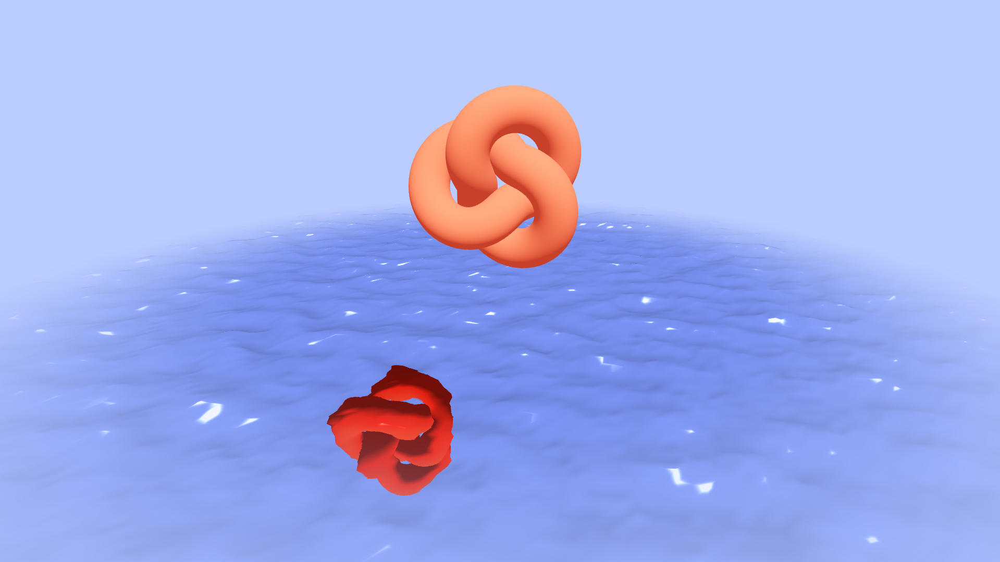

# Custom Water Shader

A **fully custom GLSL water shader** built with **React Three Fiber** and **Three.js**, featuring animated waves, dynamic reflections, and procedurally generated surface distortion. Built for performance and realism using noise-based vertex displacement and a pixelated reflection map.

[](https://water-shader-seven.vercel.app/)

---

## ✨ Features

* 🔮 **GLSL Water Shader** with animated vertex displacement
* 🌀 **Procedural Noise** using layered simplex noise (cnoise)
* 🪞 **Dynamic Reflection Map** via framebuffer texture input
* 🔧 **Real-Time Uniform Control** through React props
* 🌫️ **Roughness Simulation** via multi-scale noise-based UV distortion
* 📐 **Perspective-Correct Grid** blended with reflections
* 🎮 **Custom Camera Setup** for immersive viewing

---

## 🧠 How It Works

* **Vertex Shader** uses layered `cnoise` to displace geometry in Y-axis based on `uTime`, `uFrequency`, and `uAmplitude`.
* **Fragment Shader** samples a reflection texture using `gl_FragCoord.xy`, modified by distortion noise to simulate roughness.
* **Grid Highlighting** is mixed with reflections using a smart checker pattern to create a stylized water surface.
* **Real-Time Updates** occur through the `useFrame()` hook in React to drive uniform values like time and config props.
* **Shaders Modularized** with separate includes for `noise.glsl`, `functions.glsl`, `vertex.glsl`, and `fragment.glsl`.

---

## 🛠️ Built With

* [**React Three Fiber**](https://docs.pmnd.rs/react-three-fiber) – React renderer for Three.js
* [**Three.js**](https://threejs.org/) – Low-level WebGL engine
* [**GLSL**](https://thebookofshaders.com/) – Shader code for wave + reflection logic
* [**Vite**](https://vitejs.dev/) – Fast dev server with native GLSL imports (`?raw`)

---

## 🚀 Getting Started

```bash
# Clone the repository
git clone https://github.com/riki-k-dev/water-shader.git

cd water-shader

# Install dependencies
npm install

# Start development server
npm run dev

# Build for production
npm run build

# Preview build
npm run preview
```

---

## 📄 License

MIT License.
